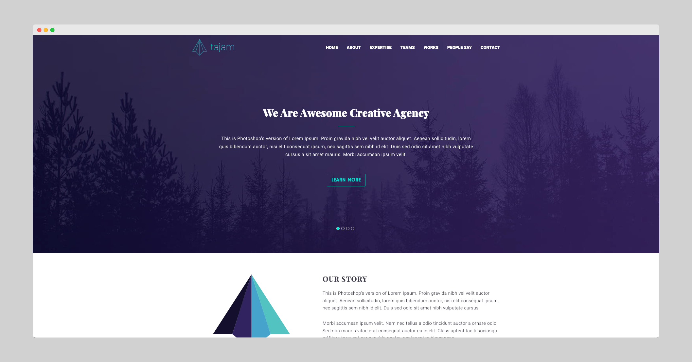

# TAJAM

## Project Overview
Tajam is a single-page landing website built using HTML, CSS, and JavaScript. It features a modern web design with a responsive layout and interactive elements. This project can serve as a template for creative agencies, freelancers, or as a learning resource for frontend development.

## Technologies Used
- **HTML5** — semantic markup
- **CSS3** — styling and responsive design
- **JavaScript (ES6+)** — interactivity and dynamic elements

## Live Demo
[View the live site here](https://irinaboiko.github.io/tajam/)

## Preview

## Getting Started
1. Clone the repository: `git clone https://github.com/irinaboiko/tajam.git`
2. Open `index.html` in your web browser. This is a static site - no setup or installation is required.

